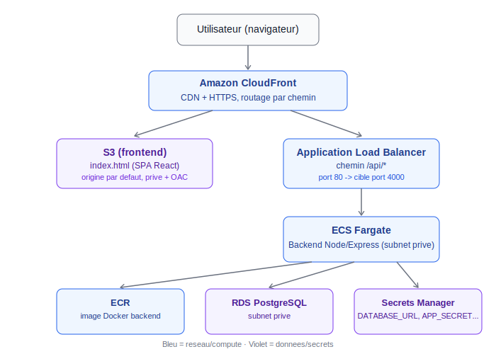
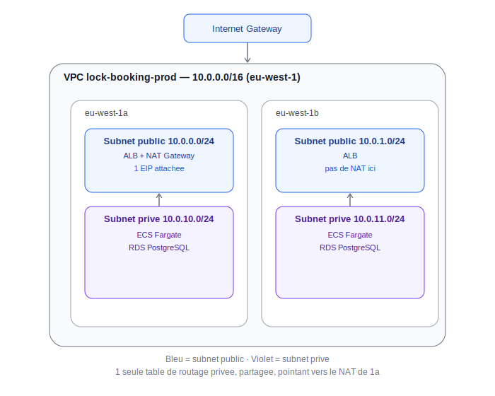

# Architecture AWS

Cette architecture est deployee dans `infra/terraform`, organisee en modules Terraform separes, avec un VPC dedie (pas le VPC par defaut AWS). Le deploiement a ete effectue manuellement, module par module (voir `DEPLOYMENT.md`) ; aucun workflow CI/CD n'est utilise actuellement.

## Vue d'ensemble des services



| Service | Role | Isolation |
|---|---|---|
| CloudFront | CDN, HTTPS, routage `/api/*` vers l'ALB, tout le reste vers S3 | Public |
| S3 (frontend) | Fichiers statiques du build React (Vite, single-file) | Prive, acces uniquement via CloudFront (OAC) |
| ALB | Repartition du trafic HTTP vers les taches ECS | Subnet public |
| ECS Fargate | Backend Node/Express, conteneurise | Subnet prive |
| RDS PostgreSQL | Base de donnees | Subnet prive, non accessible publiquement |
| ECR | Registre de l'image Docker backend | Public (API AWS), image jamais exposee directement |
| Secrets Manager | `DATABASE_URL`, `APP_SECRET`, `PRO_PASSWORD` | Lus uniquement par le role d'execution ECS |

## Reseau (VPC)



- VPC dedie `10.0.0.0/16`, region `eu-west-1`, 2 zones de disponibilite.
- Un seul NAT Gateway (dans `eu-west-1a`) pour limiter les couts ; la table de routage privee est partagee entre les deux AZ.
- ECS et RDS vivent exclusivement dans les subnets prives, jamais exposes a une IP publique.

## Organisation du code (`infra/terraform`)

```
infra/terraform/
├── main.tf                  appelle les modules
├── variables.tf
├── outputs.tf
├── backend.tf                config partielle (backend "s3" {})
├── backend-config/prod.hcl   valeurs reelles du backend (bucket, region, table)
├── terraform.tfvars.example
└── modules/
    ├── vpc/
    ├── alb/
    ├── ecr/
    ├── rds/
    ├── ecs/
    └── frontend/
```

Le state Terraform de ce projet est stocke a distance (S3 + verrou DynamoDB), crees par un projet Terraform separe (voir `DEPLOYMENT.md`, section 1).

## Securite

- Aucune ressource de donnees (RDS) ni de calcul (ECS) n'a d'IP publique.
- Le security group RDS n'accepte que le trafic depuis le security group des taches ECS, port 5432.
- Le security group ECS n'accepte que le trafic depuis le security group de l'ALB, port 4000.
- Les secrets applicatifs ne transitent jamais en clair dans la task definition ECS : ils sont references par ARN et resolus par AWS Secrets Manager au demarrage de la tache.
